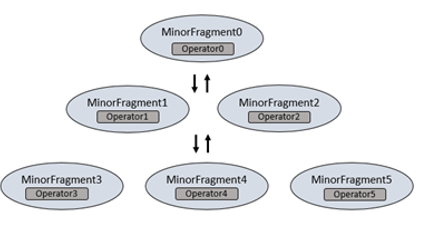
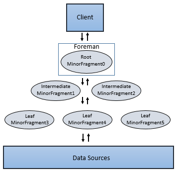

(翻译自Drill官网)

```txt
当您提交Drill查询的时候，客户端或应用程序会把查询以SQL语句的形式发送到Drill集群的一个Drillbit。Drillbit是在每个在线的Drill节点上运行的进程，它负责协调，规划和执行查询，并按照最大限度地实现数据本地化的原则在集群中分发查询。
```

下图描述了客户端，应用和drillbit之前的通信：


从客户端或应用端接收查询的那个drillbit会成为这个查询是的“接待员”，会负责驱动整个查询。这个”接待员“drillbit进程中有一个解析器，这个解析器解析这个SQL语句，应用一系列定制的规则，并把特定的SQL操作符翻译成相应的Drill能理解的逻辑操作符。这一系列逻辑操作符形成了一个逻辑计划。这个逻辑计划描述了为了得到查询结果需要做的工作，以及需要的数据源以及要进行的处理。

这个“接待员”drillbit 会将这个逻辑计划发送到一个基于开销核算的优化器，这个优化器会调整SQL操作符的顺序。优化器会应用各种各样的规则来做操作符和函数的对齐操作，并形成一个物理计划。最终就是，优化器将逻辑计划转换成了一个描述这个查询如何工作的物理计划。


一个“parallelizer"会将一条物理计划转换成若干条短语，这些短语我们称之为”一级碎片“和”次级碎片“。


## Major Fragments
一个”Major Fragments“是这样一个概念，可以说是代表了Dril查询的一个阶段。一个”阶段(phase)“是Drill执行查询时必须执行的一个或多个操作单元。Drill会给每个Major Fragments 分配一个MajorFragmentID.

例如，为了计算两个文件的Hash，Drill可能就会创建两个主要阶段（两个Major fragments）,第一阶段用来扫描文件 ，第二阶段则用来聚合数据。


Drill使用”Exchange Operator "来连接不同的Major fragments。一个"exchange"是指的数据的位置移动，或是将物理计划并行化的操作。一个“exchange"包含一个sender一个receiver,这使得数据可以在不同的节点间移动。

你可以在一个物理计划中用这种方式来参与Major fragments：你可以把物理计划导出到一个JSON文件中，手动修改它，并使用SUBMIT PLAN命令将这个json提交回Drill。你也可以在查询分析器中查看这些Major fragments,查询分析器可以通过Drill的WEB终端登入。请查询EXPLAIN和Query Profiles章节来获得更多信息。

## Minor Fragments
每个Major Fragments 都可以并行化到一系列Minor Fragments;一个Minor Fragments是一个线程中运行的一个工作的逻辑单元。Drill中的一个逻辑工作单元，也被为一个”切片“。Drill 创建的执行计划，是由若干Minor Fragments组成的。Drill给每个Minor Fragments分配了一个MinorFragmentID;


在”接待员“drillbit中的”并行器“是负责从一个Major Fragment中创建出若干个Minor Fragments，做法就是将一个Major Fragment 打散成尽可能多的能在集群中同时运行的minor fragments.

Drill在单独的线程内运行Minor Fragments,并且尽可能地快（这要看它依赖的上游数据）。Drill会把Minor Fragments归划到拥有数据本地化的那些节点上运行。如果做不到，Drill会在当前可用的Drillbit中使用那个流行的Round-Robbin算法进行分配。

Minor Fragments 包含一个或多个关系运算符。每个运算符执行一个操作，比如scan,filter,join,或是group by。每个运行符都有一个操作类型和一个操作ID（operationID).每个操作ID定义了它和它所从属的Minor Fragment和关系。请查阅”物理操作符“章节。



例如，当执行两个文件的Hash聚合操作时，Drill将第一个阶段（扫行扫描文件的阶段）打散成两个Minor frametns,每个minor fragments 包含一个扫描文件的扫描运算符。Drill把那个专司于进行数据聚合的阶段打散成4个minor fragments,四个中的每一个都包含 一个专门对数据做hash聚合的Hash 运算符。

你不能修改执行计划中的minor fragments的数量。不过，你可以在Drill web console中查看Query profiler并修改能够改变minor fragments行为的一些配置，比如修改最大切片数。请查阅”选项配置“章节。

## Minor Fragments的执行
Minor Fragments可以作为叶子fragment，根fragment和中间fragment来运行。一棵执行树只能有一个根fragment.整棵执行树上的协调是通过从根fragment开始的数字来进行的，根节点的数字是0.数据流从叶子fragment到根fragment一个个地往下流。

根fragment运行在“接待员”Drillbit上，他接受查询，从数据表中读取元数据，重写查询，并将查询路由到执行树中的下一层。其他的fragments会成为叶子fragments或是中间fragments。

中间fragment会在数据可用，或是其他fragment将数据喂过来的时候开始执行。它们在数据上执行操作，并把它们往下传。它们也会把聚合过的数据传给根fragment,根fragment又会做进一步的聚合操作或者是把查询结果提供给客户端或是应用程序。

叶子fragment并行地扫表，或者是和存储层打交道，或是是读本地磁盘数据。叶子fragments把中间结果回传给中间fragments,中间fragments会接着在这些中间结果上各种并行操作。  



Drill只会规划那些可以并发执行的fragments的查询，例如，如果一个集群只有20个切片，Drill会在那个Major fragment中规划最多20个minor fragments。Dril会乐观地假定它能并发地执行任务。一个Major fragments中的minor framents由于共同的上游数据依赖，会于同一时间开始执行。

[上一篇：Drill官网文档翻译一：Drill基本架构](Drill基本架构.md)  
 [下一篇：Drill官网文档翻译三：Drill核心模块](Drill的核心模块.md)
