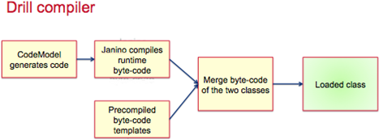

（翻译自apache drill 官网。）

Drill是从地基开始就奔向高性能和大数据集去设计的，下面列出来的是Drill能够做到高性能的核心要点。

## 分布式的引擎
Drill提供了一个强大的分布式引擎来处理查询。用户可以从集群的任何一个节点是提交查询。你可以添加新的节点到集群中，以为了支持更多用户的更多数据，或是获得更好的性能。

## 列式执行
通过使用一种纯内存的分层的，列式的数据模型，Drill同时为列式存储，列式执行都做了优化。当数据是存储在列式存储的文件上时（比如像Parquet)Drill会避免去访问那些查询中根本不涉及到的列。Drill的执行层同样可以直接对列式数据进行SQL查询，而不需要做一个分行化的操作。列式存储和直接列式执行，这两个优化的组件显示地降低了内存消耗，并为BI和分析类型的作业提供了更快的执行效率。

## 向量化
相比一次只处理一个表记录中的一个值 ，Drill中的向量化允许CPU在向量上操作，也就是一批记录上操作。一个记录批次包含来自不同的记录上的一组数值 。向量处理能够做到非常高效的技术基础，在于现在的芯片技术，这些芯片都携带了深度流水线化的CPU设计。让所有管理都达到接近峰值的高效是不可能的，因为代码复杂度太高了。

## 运行时编译
运行时编译相比解释执行提供了更快的执行。Drill为每一条查询指令都生成了非常高效的指令。下图展示了Drill的编译和指令生成过程。

## 乐观并且流水线的查询执行
Drill 使用乐观的执行模型来处理查询，假定在小片的查询中失败是不太常见的。Drill不会浪费时间在创建边界或是检查点上，这样就可以最小化恢复时间。在单条查询失败的时候，这条查询就直接返回了。Drill执行使用一种所有任务一次性安排的流水线模型。查询尽可能地在内存中执行以便能在流水线中完成作业，只有内存不足时才会持久化到磁盘。

[上一篇：Drill官网文档翻译三：Drill的核心模块](Drill的核心模块.md)  
 [下一篇：Drill官网文档翻译五：连接到数据源](连接到数据源.md)
