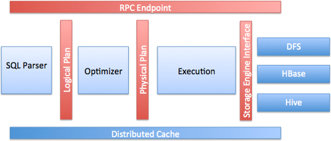

(翻译自Drill官网)

# 核心模块
下图描述了一个drillbit里的各个组件

下面列出drillbit里的关键组件：

## RPC endpoint
Drill开发了一种基于Probobuf的损耗非常低的RPC通信协议来跟客户端打交道。另外，客户端程序也可以使用C++或是JAVA api层来跟Drill交互。客户端可以直接指定跟哪些Drillbit节点打交道，也可以在提交查询前通过zookeeper服务来获取一定数量的drillbit节点信息。
我们推荐客户端总是通过zookeeper，以隔离集群管理的复杂性，不用关心像添加或是删除节点等等。

## SQL解析器
Drill 使用calcite 这个开源的SQL解析框架来解析接收到的SQL查询。这个解析组件的输出是一个人类语言无法描述，但是机器易于理解的逻辑计划,这个逻辑计划能够刚好描述这个sql查询。

## Storage plugin interface:
Drill为好几种不同的数据源充当上面的查询层的角色。Drill里的存储层插件就描述了Drill怎样和这些数据源交互的抽象。存储插件给Drill提供以下信息:

在数据源里能得到的元数据；
Drill读写数据源的接口;
数据的位置 ，以及一系列优化规则，这些优化规则能够让在特定的数据源上的drill规则执行的更高效；
在Hadoop的场景下，Drill是在提供了存储插件来处理分布式的文件和HBase.Drill也通过提供存储插件来集成了Hive的支持。

当用户通过Drill来查询文件或是HBase,他们可以直接执行，如果Hive有定义元数据的话，也可以通过Hive来执行。Drill集成Hive仅仅是为了元数据，Drill处理任何请求的时候都不执行Hive的查询执行引擎。

[上一篇：Drill官网文档翻译二：Drill查询的执行](Drill查询的执行.md)  
 [下一篇：Drill官网文档翻译四：Drill的性能](Drill的性能.md)
