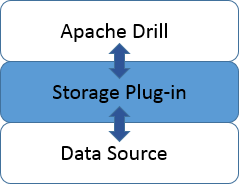

存储插件是Drill中，连接到数据源的模块。一个存储插件通常会优化Drill查询的执行，提供数据的定位，命名空间下的配置和读数据要用到的格式。Drill已经内置了一些存储插件，你只需要根据你的环境配置一下就可以使用了。借助存储插件，你可以连接到各种数据源，像数据库，本地或是分布式的文件，或是Hive数据库。

你可以修改一个存储插件的默认配置X，并给一个新的唯一的名字"Y"。这个新的文档就会把Y当成一个完全不同的插件，虽然它本身只是原有插件重新配置了一下。当你执行一个drill查询的时候，Drill通过以下几种方式得到存储插件的配置：

Query中的FROM语句指定要使用的插件。
在执行Query之前执行USE命令；
你还可以启动Drill的时候指令存储插件。
存储插件的内部
下图描述了位于Drill和数据源中间的存储插件层：

除了前面进到的这些功能，存储插件层还提供了扫描，写数据的功能，并能够将来自navive层的一些能力，比如动作推断，jon,SQL 等等知会到执行引擎。

[上一篇：Drill官网文档翻译四： Drill的性能](Drill的性能.md)  
[下一篇：Drill官网文档翻译六：存储插件的注册](存储插件的注册.md)
